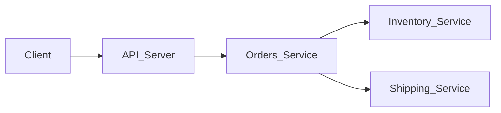

# What is this repo about ?

Rookout's debugging capabilities making a cross-services debugging super easy and intuitive.

This repo contains an example of a back-end application written using [GCP serverless](https://cloud.google.com/serverless) components.

The back-end constructed of several micro services for a purpose to show how to use Rookout in a cross-services debugging scenarios.

Enjoy :)

---


## Applicaiton Architecture 


# Setup instructions
1. Register [here](https://app.rookout.com) to get your ROOKOUT TOKEN. it's free :) 
2. Run the following commands at the repo root folder
    
    ```
    export ROOKOUT_TOKEN=<your token>
    export GCP_PROJECT=<your gcp project id>
    make deploy-all
    ```
3. Take a look at the [makefile](./makefile) to better understand the deployment flow
4. Grab a cup of ☕️
5. Happy debugging ! 🔎

# More about Rookout

Rookout makes Developer-First Observability tools.

You can learn more on our [official website](https://rookout.com)


